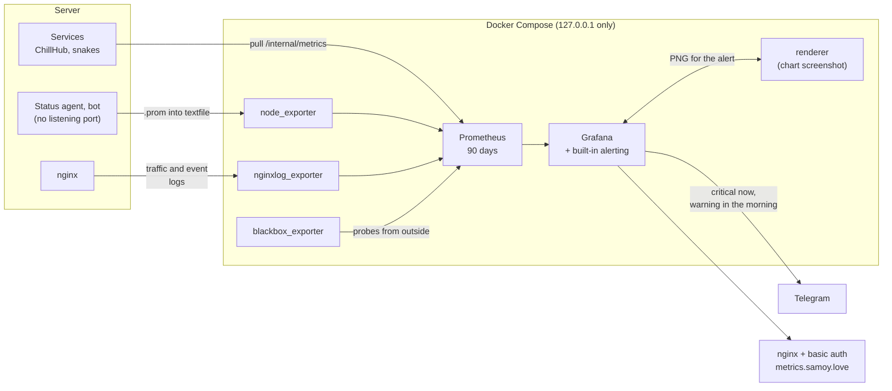

# metrics.samoy.love

[Русский](README.md) · English

[](https://github.com/samoy-love/metrics.samoy.love/actions/workflows/ci.yml)
[](LICENSE)


Monitoring and product analytics for the single small server that runs all of
[samoy.love](https://samoy.love): five sites, several services and a desktop
launcher — brought up with one command.

## Why

"The service is alive" and "people are using it, and it works for them" are
different questions, and only the first one is answered by a process being up.
A green healthcheck says nothing about updates that fail halfway, hashes that
do not match, or a page nobody has opened in a week. So the stack collects both
layers at once: host and unit state on one dashboard, product numbers on the
other.

The second constraint is privacy. Traffic is counted from a separate nginx log
that physically has no IP, no User-Agent, no Referer and no query string — a
process that never saw personal data cannot leak it by accident.

Some things never reach the server at all: metro computes routes in the
browser and works offline, a PWA is installed straight from the cache, a
"Play" press happens before any connection. Those are counted by an empty
`POST /e/<event>` answered with 204 — no body, no parameters, no cookie, no
session or visitor id. The log line holds the host, the event name and zero
bytes, so one person's path cannot be reconstructed: there is nothing to join
the lines on. What happened is counted; who did it is not.

The homepage used to promise "zero trackers". Once these counters appeared
that stopped being literally true, so the promise now names what is actually
absent instead.


<sub>Frames captured from the live stand with
[`docs/render-dashboards.sh`](docs/render-dashboards.sh), which also captures
the per-project dashboards. Empty panels in the ChillHub client-telemetry
section are not a fault: the deployed launcher does not send those events yet,
and the panels are provisioned ahead of time so the first data points are not
missed.</sub>

## How it works



**Three delivery paths, because the sources differ.** Some components expose an
HTTP endpoint and are simply scraped. nginx has no endpoint at all, so traffic
comes from a log file through an exporter. The status agent is a oneshot unit
driven by a timer and the Telegram bot deliberately listens nowhere — between
runs there is no process to scrape, so both write `.prom` files into the
textfile collector. Such a file must carry its own timestamp, otherwise a
stopped process keeps looking alive forever with its last values.

**Nothing is published outwards.** Every container binds to `127.0.0.1`, and
the only door is nginx with basic auth in front of Grafana and of Prometheus at
`/prometheus/`. Scrape targets on the host are reached over the docker bridge
address rather than loopback: a container lives in its own network namespace
and cannot see the host's `127.0.0.1`. That is also why ChillHub services
expose `/internal/metrics` on their own port instead of behind the public API —
product numbers must not become reachable through a forgotten `location`.

**Two host-level obstacles were worked around deliberately.** Unit state is
read over the system dbus, and the default AppArmor profile forbids a
container from talking to it — hence `apparmor=unconfined` on node_exporter,
which still mounts the host read-only and exposes no port. Separately,
`snakes.service` deliberately restricts its network (`IPAddressAllow=localhost`),
so the kernel silently dropped every scrape from the bridge. Rather than
defeating another service's restriction from the monitoring side, it was
opened on the snakes side: a drop-in admits the docker bridge subnets, and the
game exposes a separate listener serving only `/metrics`.

**Cardinality is capped at the exporter.** Path and host arrive from the
internet. Without a limit, any scanner walking `/wp-admin` and `/.env` would
create a thousand time series overnight, and those series would stay in the
TSDB forever.

**Image versions are pinned.** `latest` on arm64 periodically drifts ahead of
the other architectures, and an upgrade nobody asked for would break monitoring
exactly when it is needed. The CI reads the Prometheus version out of
`docker-compose.yml` rather than repeating it: two places holding a version
drift apart, one does not.

**Everything is provisioned from files.** Dashboards, the data source and alert
rules live in the repository and are applied at every start, so losing the
Grafana volume does not lose the panels. Prometheus history lives in a named
Docker volume instead, because it must survive a full recreate of the
containers, including an image upgrade.

Collected: host resources and systemd unit state; availability, response time
and certificate expiry for all five sites; traffic per host and path from the
nginx log; ChillHub product metrics (installs and updates by game and outcome,
diff versus full download, bytes actually transferred against the full build
size, integrity checks and hash mismatches, feedback, maintenance, version
activations); Snakes gameplay and real-time health (humans and bots counted
separately, match length, causes of death, tick duration, WebSocket drops by
reason); status page and bot results; and the monitoring stack itself. Two
dashboards, one rule for both: a panel answers a question that actually gets
asked. Deliberately absent are client-side analytics and backups of the metrics
themselves — those are operational data with nowhere and no reason to restore
them from.

**Failures are announced, not displayed.** Rules, routing and Telegram
delivery live entirely inside Grafana (`grafana/provisioning/alerting`) — the
separate Alertmanager is gone from the stack. Rules used to light up in
`/prometheus/alerts` and go out there as well: the only way to learn about a
failure was to open the panel yourself — and the panel gets opened exactly
when something has already been noticed. Splitting on `severity` is not
cosmetic: critical wakes you up (site unreachable, unit dead, disk filling up,
player progress being lost) and repeats every four hours, while warning
arrives with a delay and repeats once a day. Grouping is by rule name, because
a dead nginx is one incident, not six messages about six domains. Each message
carries a chart screenshot — rendered by the neighboring `renderer` container
(`grafana/grafana-image-renderer`); Grafana only asks for it and attaches the
result.

## Stack

| Component | Version | Role |
|---|---|---|
| Prometheus | v3.13.2 | metric storage, 90 days or 8 GB |
| Grafana | 13.1.3 | dashboards, alert rules, routing and Telegram delivery |
| grafana-image-renderer | v5.12.0 | chart screenshot attached to an alert |
| node_exporter | v1.12.1 | CPU, memory, disk, network, systemd unit state, textfile |
| blackbox_exporter | v0.28.0 | availability, response time and certificate expiry |
| nginxlog_exporter | v1.11.0 | site traffic and interface events from nginx logs |

Docker Compose, scrape interval 30 s. Resource limits are set in
`docker-compose.yml` (Prometheus 1 CPU / 1 GB, Grafana 1 CPU / 768 MB,
renderer 1 CPU / 512 MB, the exporters 0.5 CPU / 256 MB each): the server is
small, and monitoring must not become the cause of the outage it is supposed
to report.

## Quick start

The nginx configuration lives in
[deploy-kit](https://github.com/samoy-love/deploy-kit), which stays the single
source of truth for nginx. The directory on the server is
`/opt/samoylove-metrics`.

```bash
# 1. Code onto the server
rsync -a --exclude .git --exclude .env ./ ubuntu@SERVER:/opt/samoylove-metrics/

# 2. Secrets (once; a repeated run overwrites nothing).
#    The bot token comes from @BotFather — the script has no way to invent it,
#    so without the variable it stops: Grafana's contact point cannot deliver
#    a single message without it.
ssh ubuntu@SERVER "TELEGRAM_BOT_TOKEN='...' bash /opt/samoylove-metrics/server/bootstrap.sh"

# 3. Start
ssh ubuntu@SERVER 'cd /opt/samoylove-metrics && sudo docker compose up -d'

# 4. nginx — only through deploy-kit, never by hand in /etc/nginx
sudo /opt/deploy-kit/server/nginx-apply.sh \
    --app samoylove-metrics \
    --conf /opt/deploy-kit/nginx/sites/metrics.samoy.love.conf \
    --dest /etc/nginx/sites-available/metrics.samoy.love.conf --enable
```

Step 4 needs the `metrics.samoy.love` A record and a certificate to exist
already:

```bash
sudo certbot certonly --webroot -w /var/www/metrics-acme -d metrics.samoy.love
```

Without the certificate `nginx -t` fails on the missing file and
`nginx-apply.sh` honestly reverts the config.

Step 4 is only needed for the very first install. After that the config ships
itself: the target sets `NGINX_CONF` and `NGINX_DEST` (see
`.deploy-kit/prod.env`), and every deploy applies it through the same
`nginx-apply.sh` — with a diff in the log, a backup, and a revert if
`nginx -t` fails.

Access goes through two gates: nginx basic auth first, then the Grafana login.
Credentials and tokens exist only on the server, all of them in
`/opt/samoylove-metrics/.env` — basic auth lives separately, in
`/etc/nginx/.htpasswd-metrics`, while `.env` holds the Grafana admin, the
Telegram bot token (the contact point reads it via
`$__env{TELEGRAM_BOT_TOKEN}`, see
`grafana/provisioning/alerting/contactpoints.yml`), and a secret shared
between Grafana and `renderer` (`GF_RENDERING_RENDERER_TOKEN` /
`AUTH_TOKEN` — the same value under two names; without it Grafana 13
refuses to start at all, since the default `"-"` token is rejected in
production mode) — none of it is ever kept in this repository. The file sits
**next to** the releases directory, not inside it: `current/` changes with
every deploy, and a secret inside would have to travel through the build.

Where the alerts go is an address, not a secret: `chatid` sits right in
[`grafana/provisioning/alerting/contactpoints.yml`](grafana/provisioning/alerting/contactpoints.yml).
Check that the bot can actually reach the chat before the first outage, not
during it:

```bash
curl -s "https://api.telegram.org/bot$(sudo grep TELEGRAM_BOT_TOKEN /opt/samoylove-metrics/.env | cut -d= -f2-)/sendMessage" \
    -d chat_id=173418650 -d text='connectivity check'
```

A bot cannot message first: until the recipient has pressed "Start" in the
chat, Telegram answers 403, and that looks exactly like silence. That silence
used to be caught by a dedicated `AlertNotificationsFailing` rule watching
Alertmanager; delivery is now Grafana's own job, and a failure shows up in its
log or on `/alerting/list` instead — there is no longer a rule that would
report it into the same Telegram: the broken path is precisely the one it
would have to travel.

## Structure

| Path | Purpose |
|---|---|
| `docker-compose.yml` | the whole stack: images, limits, volumes, `127.0.0.1` bindings |
| `prometheus/prometheus.yml` | scrape targets and intervals (no rules — those live in Grafana) |
| `grafana/provisioning/alerting/rules.yml` | alert rules: host, units, sites, launcher, snakes, status page |
| `grafana/provisioning/alerting/contactpoints.yml` | Telegram receiver, token, message template, screenshot |
| `grafana/provisioning/alerting/policies.yml` | routing by `severity` |
| `grafana/dashboards/overview.json` | summary: project availability, traffic, server resources |
| `grafana/dashboards/chillhub.json` | launcher: site, public API, admin panel, client telemetry |
| `grafana/dashboards/snakes.json` | snakes: matches, combat, connections, server tick |
| `grafana/dashboards/die.json` | Double or Die: availability and traffic |
| `grafana/dashboards/metro.json` | metro: availability and traffic |
| `grafana/dashboards/samoylove.json` | personal site: traffic and UI events |
| `grafana/dashboards/status.json` | status page, probe agent and Telegram bot |
| `grafana/provisioning/` | data source and dashboard provisioning |
| `blackbox/blackbox.yml` | probe modules for blackbox_exporter |
| `nginxlog/nginxlog.yml` | log format and cardinality limits for the traffic exporter |
| `server/bootstrap.sh` | one-time secret setup on the server, bot token included |
| `deploy/systemd/samoylove-metrics.service` | systemd unit wrapping `docker compose` for deploy-kit |
| `docs/render-dashboards.sh` | capture dashboard PNGs, run on the server |
| `.env.example` | template for `.env`: Grafana admin, bot token, renderer secret |

## What is guaranteed, and what checks it

Configs here break silently: a typo in a rule or a drifted data source uid
brings nothing down — the panel simply shows nothing and the alert never fires.
So CI checks exactly that class of failure.

| Guarantee | Enforced by |
|---|---|
| Prometheus config (targets, intervals) parses | `promtool check config` in CI |
| Dashboards are valid JSON and point at the real data source | uid comparison against `grafana/provisioning/datasources` in CI |
| The compose file resolves | `docker compose config --quiet` in CI |
| YAML syntax across the repository is well formed | `yamllint` in CI |
| Personal data cannot leak into metrics | the log format has no IP, User-Agent, Referer or query string |
| A scanner cannot flood the TSDB | cardinality limits in `nginxlog/nginxlog.yml` |
| Metrics are not reachable from the internet | containers bind `127.0.0.1`, nginx with basic auth in front |
| History survives a container recreate | named Docker volumes, not directories in the repository |
| Panels and alert rules survive the loss of the Grafana volume | dashboards, data source and alerting are provisioned from files |

**What CI does NOT check** after the move to Grafana: `rules.yml`,
`contactpoints.yml` and `policies.yml` only get YAML syntax checked. Semantics
— the right node type inside `data`, a real datasource uid, the condition
schema — used to be `promtool check rules` / `amtool check-config` for
Prometheus/Alertmanager; there is no equivalent CLI for Grafana's provisioning
format at hand. A typo in these three files only surfaces when Grafana starts
(check its logs) or on `/alerting/list` — before shipping an alerting change,
bring the stack up and look, a green CI run is not the full guarantee here.

The rules are an explicit list of what counts as an incident, and the state of
every one of them is visible in Grafana at `/alerting/list`. Each must carry a
`severity` label: routing splits on that label and nothing else, so a rule
without it quietly joins the slow lane instead of waking anyone.

The exact rule count is deliberately absent here. It used to sit in this
paragraph and drifted away from reality silently — precisely the way of being
wrong that the rest of this repository guards against. Count them in
[`grafana/provisioning/alerting/rules.yml`](grafana/provisioning/alerting/rules.yml), not here.

The two delivery rules (`AlertmanagerDown`, `AlertNotificationsFailing`) are
gone: they watched a separate Alertmanager that no longer exists in the
stack — rules and delivery are now one process, and if that process is down
there is nobody left to report it either way. The `inhibit_rules` from the old
`alertmanager.yml` (SiteDown suppressed ProbeLatencyHigh on the same instance,
critical suppressed warning on the same alertname+instance) are also gone and
have no direct equivalent in Grafana Alerting — see the comment at the top of
`rules.yml`. In practice: one dead site can now produce more than one message
in the chat.

## Adding a scrape target

Edit `prometheus/prometheus.yml` and reload without a restart (Prometheus runs
with `--web.enable-lifecycle`):

```bash
rsync ... && ssh ... 'curl -s -X POST http://127.0.0.1:9090/prometheus/-/reload'
```

A plain service on the host:

```yaml
  - job_name: name
    static_configs:
      - targets: ["host.docker.internal:PORT"]
```

The service has to accept connections from the docker bridge address: if its
unit carries `IPAddressAllow=localhost`, the target stays `down` forever — and
silently, because the kernel drops the packets and the service log says
nothing.

A process with nothing to listen on takes the textfile collector instead: drop
a `.prom` file into `/var/lib/node_exporter/textfile/`, write it atomically
(`.tmp` plus rename) and always include a timestamp.

One more site to probe for availability only needs its URL appended to the
`blackbox-http` job — relabeling is already in place.

**Mind the inode.** `prometheus.yml` is mounted as a file. Replacing it
(`tar x`, `mv`, `rsync` without `--inplace`) changes the inode, the container
keeps reading the old file and cheerfully reports the config as reloaded — with
unchanged targets. Edit in place, or recreate the container:

```bash
sudo docker compose up -d --force-recreate prometheus
```

Directories are unaffected: new rule and dashboard files are picked up as is.

## Part of samoy.love

One domain, one server, one pipeline, one status page, one monitoring stack.

| Project | What it is |
|---|---|
| [samoy.love](https://github.com/samoy-love/samoy.love) | Homepage and project showcase: Astro, WebGL background, no cookies or third parties |
| [chillhub](https://github.com/samoy-love/chillhub) | ChillHub — Windows game launcher: diff updates, hash control, Go admin panel |
| [snakes](https://github.com/samoy-love/snakes) | Browser territory-capture multiplayer: Go, WebSocket, binary protocol |
| [metro-map](https://github.com/samoy-love/metro-map) | Offline PWA with the Moscow metro map: routing on the client, Canvas 2D |
| [double-or-die](https://github.com/samoy-love/double-or-die) | Co-op roguelike where you bet on yourself: deterministic TypeScript core |
| [status.samoy.love](https://github.com/samoy-love/status.samoy.love) | Status page: uptime, versions, incidents; Go agent plus an external watchdog |
| [metrics.samoy.love](https://github.com/samoy-love/metrics.samoy.love) | This repository: monitoring and product analytics |
| [deploy-kit](https://github.com/samoy-love/deploy-kit) | Shared release pipeline; also the nginx config and the log format |

## Contacts

Alexey Samoylov — [alex@samoy.love](mailto:alex@samoy.love) ·
[t.me/tr0llex](https://t.me/tr0llex) ·
[github.com/tr0llex](https://github.com/tr0llex)

## License

[MIT](LICENSE).
