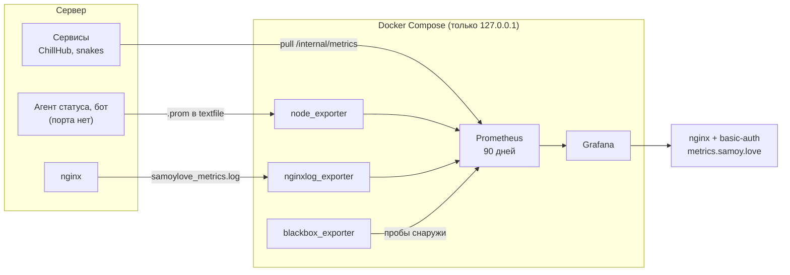

# metrics.samoy.love

**RU** · [EN](README.en.md)

Наблюдаемость одного маленького сервера, на котором живёт всё
[samoy.love](https://samoy.love): пять сайтов, несколько сервисов и десктопный
лаунчер. Prometheus собирает, Grafana показывает, всё поднимается одной
командой.

[](https://github.com/tr0llex/metrics.samoy.love/actions/workflows/ci.yml)


[](LICENSE)

<!--
  Место для скриншотов панелей. Положить в docs/ и раскомментировать:
  
  
-->

## Что здесь интересного

- **Посещаемость без единого трекера.** Ни счётчиков, ни пикселей, ни cookie:
  числа берутся из отдельного журнала nginx, в котором нет ни IP, ни
  User-Agent. Процесс, который никогда не видел персональных данных, не может
  их случайно опубликовать.
- **Продуктовые метрики, а не только «сервис жив».** Дифф против полной
  загрузки, фактически сэкономленные байты, расхождения хешей, сорванные
  установки — половина правил отвечает на вопрос «этим пользуются, и это
  работает», а не «процесс запущен».
- **Метрики от процессов, которым нечем слушать порт.** Агент статус-страницы
  — oneshot по таймеру, между запусками его просто нет; телеграм-бот
  принципиально никуда не слушает. Оба пишут в textfile-коллектор.
- **Кардинальность под замком.** Путь и домен приходят из интернета. Без
  ограничения любой сканер, перебирающий `/wp-admin` и `/.env`, за ночь создал
  бы тысячу временных рядов — и эта тысяча осталась бы в TSDB навсегда.

## Как устроено



Три разных пути доставки метрик — потому что источники разные: у одних есть
HTTP-эндпоинт, у других только журнал, у третьих вообще нет процесса в момент
опроса. Наружу при этом смотрит один nginx: контейнеры слушают `127.0.0.1`,
портов в интернет нет ни у одного.

| Компонент | Версия | Роль |
|---|---|---|
| Prometheus | v3.13.2 | хранилище метрик, 90 дней истории |
| Grafana | 13.1.1 | панели |
| node_exporter | v1.12.1 | CPU, память, диск, сеть, состояние systemd-юнитов |
| blackbox_exporter | v0.28.0 | доступность и время ответа сайтов |
| nginxlog_exporter | v1.11.0 | посещаемость статики из журнала nginx |

Версии образов закреплены: `latest` на arm64 периодически уезжает вперёд
остальных архитектур, и обновление, которого никто не просил, ломало бы
мониторинг ровно тогда, когда он нужен.

## Что собирается

- **Хост** — загрузка CPU по режимам, память, свободное место по файловым
  системам, сеть, load average, аптайм.
- **Сервисы** — состояние юнитов `snakes`, `chillhub-api`, `chillhub-admin`,
  `status-agent`, `nginx`, `docker` и юнитов резервного копирования.
  `status-agent` и `*-backup` запускаются по таймеру, поэтому большую часть
  времени они не `active` — это норма, а не авария.
- **Сайты** — samoy.love, metro, launcher, snakes, status: код ответа, время
  ответа, срок действия сертификата.
- **Посещаемость статики** — samoy.love и metro: запросы по домену и пути,
  коды ответов, время ответа, отданный объём. Источник — отдельный журнал
  nginx `samoylove_metrics.log` (формат объявлен в
  [deploy-kit](https://github.com/tr0llex/deploy-kit)), в котором нет ни IP,
  ни User-Agent: клиентские счётчики на этих сайтах ставить нельзя, в README
  главной обещан ноль трекеров.
- **ChillHub** — продуктовые метрики лаунчера: установки и обновления по
  играм и результату, режим обновления (`diff`/`full`), фактически скачанные
  байты против полного веса сборки, проверки целостности и расхождения хешей,
  обратная связь, техработы, активации версий, коды и время ответов.
- **Статус-страница и бот** — результаты проверок, время ответа, запас по
  сертификатам, инциденты, свежесть данных агента и отправленные уведомления.
- **Сам мониторинг** — метрики Prometheus и Grafana.

Дашбордов два: **обзор** (хост, сервисы, доступность сайтов) и **продукт**
(посещаемость, загрузки и установки лаунчера, состояние статус-страницы).
Правило для обоих одно: панель отвечает на вопрос, который действительно
задают. «Красиво, но незачем» — повод удалить панель, а не добавить.

Чего нет и почему:

- **Клиентской аналитики.** Посещаемость считается из журналов сервера, и
  посетитель ничего для этого не выполняет. Журнал `samoylove_metrics.log`
  ротируется штатным правилом `/var/log/nginx/*.log` (14 дней), экспортёр
  переоткрывает файл сам.
- **Alertmanager.** 19 правил в `prometheus/rules/` есть, маршрутизации
  уведомлений нет: уведомлять некого, владелец смотрит панель. Правила нужны
  как явный список того, что считается аварией, — их состояние видно в
  `/prometheus/alerts`.
- **Резервных копий метрик.** Намеренно: это оперативные данные,
  восстанавливать их неоткуда и незачем.
- **Snakes.** Цель заведена, но пока `down` — подробности ниже.

## Ловушки, на которые тут наступили

Три штуки, каждая стоила вечера.

**AppArmor и systemd.** Сбор состояния юнитов идёт через системную шину dbus,
а профиль AppArmor по умолчанию запрещает контейнеру с ней разговаривать
(«An AppArmor policy prevents this sender…»), и коллектор systemd молча отдаёт
ноль метрик. Отсюда `apparmor=unconfined` у node_exporter — контейнер при этом
монтирует хост только на чтение и своих портов наружу не имеет. Вдобавок в
образе нет симлинка `/var/run` → `/run`, а экспортёр ищет шину именно по
`/var/run/dbus/...`, поэтому сокет монтируется сразу по нужному пути.

**`IPAddressDeny=any` у чужого юнита.** `snakes.service` запущен с
`IPAddressAllow=localhost`, то есть ядро режет любое подключение не с
`127.0.0.1`. Prometheus сидит в своём сетевом namespace и приходит с адреса
docker-моста — получает таймаут. Снять это можно только на стороне snakes,
drop-in к юниту; обходить намеренное ограничение чужого сервиса из мониторинга
мы не стали, поэтому цель честно висит `down`. По той же причине сервисы
ChillHub слушают экспортёром `172.17.0.1`, а не `127.0.0.1`: этот адрес виден
с хоста и его контейнеров и не отвечает на публичном адресе сервера.

**Монтирование одного файла — это монтирование inode.** `prometheus.yml`
примонтирован файлом. Если положить новый файл поверх (`tar x`, `mv`, `rsync`
без `--inplace`), inode сменится, контейнер продолжит читать старый файл и
бодро отрапортует, что конфиг перечитан, — при неизменных целях. Правьте файл
на месте либо пересоздайте контейнер. Каталогов это не касается: новые файлы
правил и дашбордов подхватываются как есть.

## Установка

Конфиг nginx живёт не здесь, а в
[deploy-kit](https://github.com/tr0llex/deploy-kit) — он остаётся единственным
источником правды по nginx.

Каталог на сервере — `/opt/samoylove-metrics`.

```bash
# 1. Код на сервер
rsync -a --exclude .git --exclude .env ./ ubuntu@СЕРВЕР:/opt/samoylove-metrics/

# 2. Секреты (один раз; повторный запуск ничего не перезапишет)
ssh ubuntu@СЕРВЕР 'bash /opt/samoylove-metrics/server/bootstrap.sh'

# 3. Запуск
ssh ubuntu@СЕРВЕР 'cd /opt/samoylove-metrics && sudo docker compose up -d'

# 4. nginx — только через deploy-kit, руками в /etc/nginx не ходим
sudo /opt/deploy-kit/server/nginx-apply.sh \
    --app samoylove-metrics \
    --conf /opt/deploy-kit/nginx/sites/metrics.samoy.love.conf \
    --dest /etc/nginx/sites-available/metrics.samoy.love.conf --enable
```

Шаг 4 требует, чтобы уже существовали A-запись `metrics.samoy.love` и
сертификат:

```bash
sudo certbot certonly --webroot -w /var/www/metrics-acme -d metrics.samoy.love
```

Без сертификата `nginx -t` упадёт на отсутствующем файле, и `nginx-apply.sh`
честно откатит конфиг.

Автозапуск после перезагрузки обеспечивают `restart: unless-stopped` плюс
включённый `docker.service` — одного `restart` мало, если сам демон не
поднимается при старте системы.

## Эксплуатация

Панель: **https://metrics.samoy.love/** (Grafana), Prometheus — по адресу
**https://metrics.samoy.love/prometheus/**.

Два рубежа: сначала basic-auth nginx, затем логин Grafana. Пароли лежат только
на сервере — в репозитории их нет и быть не должно: basic-auth в
`/etc/nginx/.htpasswd-metrics`, администратор Grafana в
`/opt/samoylove-metrics/.env`.

**Добавить цель.** Правится `prometheus/prometheus.yml`, дальше — перечитать
конфиг без перезапуска (Prometheus запущен с `--web.enable-lifecycle`):

```bash
rsync ... && ssh ... 'curl -s -X POST http://127.0.0.1:9090/prometheus/-/reload'
```

Помня про inode из раздела выше — либо правка на месте, либо:

```bash
sudo docker compose up -d --force-recreate prometheus
```

Обычный сервис на хосте:

```yaml
  - job_name: имя
    static_configs:
      - targets: ["host.docker.internal:ПОРТ"]
```

Сервис должен принимать подключения с адреса docker-моста: если у его юнита
стоит `IPAddressAllow=localhost`, цель будет вечно `down`.

Процессу, которому нечем слушать порт, подходит textfile-коллектор: класть
`.prom` в `/var/lib/node_exporter/textfile/`, писать атомарно (через `.tmp` и
переименование) и обязательно отдавать отметку времени — иначе остановленный
процесс будет вечно выглядеть живым со своими последними значениями.

Ещё один сайт для проверки доступности — достаточно дописать URL в
`static_configs` джоба `blackbox-http`, релейблинг уже настроен.

**Данные.** Именованные тома Docker, а не каталоги в репозитории: история
должна пережить полное пересоздание контейнеров, в том числе со сменой версии
образа.

| Том | Что внутри |
|---|---|
| `samoylove-metrics_prometheus-data` | TSDB, 90 дней или 8 ГБ |
| `samoylove-metrics_grafana-data` | база Grafana |

Дашборды и источник данных в этой базе не хранятся: они провижинятся из
`grafana/` при каждом старте, поэтому потеря тома Grafana не потеряет панели.

**Ресурсы.** Сервер маленький, и мониторинг не должен становиться причиной
аварии, о которой он же и должен предупреждать. Лимиты заданы в
`docker-compose.yml`: Prometheus — 1 CPU / 1 ГБ, Grafana — 1 CPU / 768 МБ,
экспортёры — по 0.5 CPU / 256 МБ. Логи контейнеров ротируются (3 файла по
10 МБ).

## Где это в общей картине

Всё ниже работает в проде на одном сервере и катится одним пайплайном.

| Репозиторий | Связь |
|---|---|
| [samoy.love](https://github.com/tr0llex/samoy.love) | главная страница; её посещаемость считается здесь |
| [status.samoy.love](https://github.com/tr0llex/status.samoy.love) | статус-страница наружу, для посетителей; метрики — внутрь, для владельца. Агент пишет сюда через textfile |
| [chillhub](https://github.com/tr0llex/chillhub) | лаунчер игр, источник всех продуктовых метрик |
| [deploy-kit](https://github.com/tr0llex/deploy-kit) | общий релизный пайплайн; оттуда же конфиг nginx и формат журнала |
| [metro-map](https://github.com/tr0llex/metro-map) | офлайн-схема метро; посещаемость считается здесь |
| [snakes](https://github.com/tr0llex/snakes) | цель заведена, пока `down` (см. ловушки) |

## Лицензия

[MIT](LICENSE).
