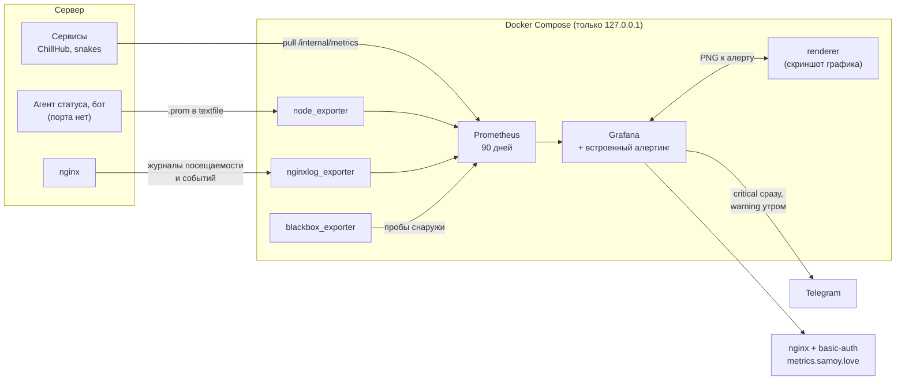

# metrics.samoy.love

Русский · [English](README.en.md)

[](https://github.com/samoy-love/metrics.samoy.love/actions/workflows/ci.yml)
[](LICENSE)


Мониторинг и продуктовая аналитика одного маленького сервера, на котором живёт
всё [samoy.love](https://samoy.love): пять сайтов, несколько сервисов и
десктопный лаунчер — поднимается одной командой.

## Зачем

«Сервис жив» и «им пользуются, и у людей всё работает» — разные вопросы, и на
первый отвечает всего лишь запущенный процесс. Зелёный healthcheck не говорит
ничего ни про обновления, срывающиеся на середине, ни про расхождения хешей,
ни про страницу, которую неделю никто не открывал. Поэтому собираются оба
слоя сразу. Разложены они по дашбордам: у каждого проекта свой, а хост,
доступность и посещаемость всех сайтов сведены в общий. Один дашборд на всё
означал бы, что за чужими панелями не видно своих: у лаунчера и змеек
компонентов по пять, и падают они порознь.

Второе ограничение — приватность. Посещаемость считается из отдельного журнала
nginx, в котором физически нет ни IP, ни User-Agent, ни Referer, ни строки
запроса: процесс, который никогда не видел персональных данных, не может их
случайно опубликовать.

Часть вещей до сервера не доходит вовсе: метро считает маршруты в браузере и
работает офлайн, приложение ставится прямо из кеша, нажатие «Играть»
случается до всякого подключения. Это считается пустым `POST /e/<событие>` с
ответом 204 — ни тела, ни параметров, ни cookie, ни идентификатора сессии или
посетителя. В журнале остаётся домен, имя события и ноль байт, поэтому
восстановить путь одного человека нельзя: пересечь строки между собой не по
чему. Считается, ЧТО произошло, а не КТО это сделал.

Раньше главная обещала «ноль трекеров». После появления этих счётчиков
обещание перестало быть правдой буквально, и теперь оно сформулировано от
того, чего действительно нет.


<sub>Кадр снят с живого стенда скриптом
[`docs/render-dashboards.sh`](docs/render-dashboards.sh); он же снимает и
дашборды отдельных проектов. Пустые панели клиентской телеметрии ChillHub —
не поломка: у лаунчера на сервере ещё нет версии, которая шлёт эти события, а
панели заведены заранее, чтобы не пропустить первые же данные.</sub>

## Как устроено



**Три пути доставки, потому что источники разные.** У одних компонентов есть
HTTP-эндпоинт, и их просто опрашивают. У nginx эндпоинта нет вовсе, поэтому
посещаемость приходит из файла журнала через экспортёр. Агент статус-страницы —
oneshot по таймеру, а телеграм-бот принципиально никуда не слушает: между
запусками опрашивать нечего, и оба пишут `.prom` в textfile-коллектор. Такой
файл обязан нести собственную отметку времени — иначе остановленный процесс
будет вечно выглядеть живым со своими последними значениями.

**Наружу не смотрит ничего.** Каждый контейнер слушает `127.0.0.1`, и
единственная дверь — nginx с basic-auth перед Grafana и перед Prometheus на
`/prometheus/`. До целей на хосте сбор ходит по адресу docker-моста, а не по
loopback: контейнер живёт в своём сетевом namespace и `127.0.0.1` хоста не
видит. По той же причине сервисы ChillHub отдают `/internal/metrics` на своём
порту, а не за публичным API: продуктовые числа не должны становиться
доступны через забытый `location`.

**Два ограничения хоста обойдены осознанно.** Состояние юнитов читается через
системную шину dbus, а профиль AppArmor по умолчанию запрещает контейнеру с
ней разговаривать — отсюда `apparmor=unconfined` у node_exporter, который при
этом монтирует хост только на чтение и своих портов не имеет. Отдельно:
`snakes.service` намеренно режет сеть (`IPAddressAllow=localhost`), и ядро
молча гасило сбор с моста. Обходить чужое ограничение со стороны мониторинга
не стали — развязали на стороне snakes: drop-in открывает подсети
docker-мостов, а игра поднимает отдельный слушатель только для `/metrics`.

**Кардинальность ограничена на экспортёре.** Путь и домен приходят из
интернета. Без ограничения любой сканер, перебирающий `/wp-admin` и `/.env`,
за ночь создал бы тысячу временных рядов — и эта тысяча осталась бы в TSDB
навсегда.

**Версии образов закреплены.** `latest` на arm64 периодически уезжает вперёд
остальных архитектур, и обновление, которого никто не просил, ломало бы
мониторинг ровно тогда, когда он нужен. Версию Prometheus для проверок CI
берёт из `docker-compose.yml`, а не пишет второй раз: два места с версией
разъезжаются, одно — нет.

**Всё провижинится из файлов.** Дашборды, источник данных и правила лежат в
репозитории и применяются при каждом старте, поэтому потеря тома Grafana не
теряет панели. История Prometheus, наоборот, живёт в именованном томе Docker:
она обязана пережить полное пересоздание контейнеров, в том числе со сменой
версии образа.

Что собирается: ресурсы хоста и состояние systemd-юнитов; доступность, время
ответа и срок сертификата всех пяти сайтов; посещаемость по домену и пути из
журнала nginx; продуктовые метрики ChillHub (установки и обновления по играм и
результату, дифф против полной загрузки, фактически скачанные байты против
полного веса сборки, проверки целостности и расхождения хешей, обратная связь,
техработы, активации версий); игровые метрики Snakes и здоровье реального
времени (люди и боты отдельными счётчиками, длительность матча, причины
смерти, длительность игрового такта, обрывы WebSocket по причине); результаты
статус-страницы и бота; сам мониторинг. Дашбордов два, правило для обоих одно:
панель отвечает на вопрос, который действительно задают. Сознательно нет
клиентской аналитики и резервных копий самих метрик — это оперативные данные,
восстанавливать их неоткуда и незачем.

**Об аварии сообщают, а не показывают.** Правила, маршрутизация и доставка в
Telegram целиком в Grafana (`grafana/provisioning/alerting`) — отдельного
Alertmanager в стеке больше нет. Раньше правила зажигались в
`/prometheus/alerts` и там же гасли: узнать о поломке мог только тот, кто сам
открыл панель, — а открывают её как раз тогда, когда уже что-то заметили.
Разделение по `severity` не косметическое: critical будит (сайт недоступен,
юнит мёртв, кончается диск, теряется прогресс игроков) и напоминает о себе
каждые четыре часа, warning приходит с задержкой и повторяется раз в сутки.
Группировка идёт по имени правила, потому что упавший nginx — это один
инцидент, а не шесть сообщений про шесть доменов. К сообщению прикладывается
скриншот графика — его рендерит соседний контейнер `renderer`
(`grafana/grafana-image-renderer`), Grafana только просит и вкладывает
результат.

## Стек

| Компонент | Версия | Роль |
|---|---|---|
| Prometheus | v3.13.2 | хранилище метрик, 90 дней или 8 ГБ |
| Grafana | 13.1.3 | панели, правила алертинга, маршрутизация и доставка в Telegram |
| grafana-image-renderer | v5.12.0 | скриншот графика к алерту |
| node_exporter | v1.12.1 | CPU, память, диск, сеть, состояние юнитов, textfile |
| blackbox_exporter | v0.28.0 | доступность, время ответа, срок сертификата |
| nginxlog_exporter | v1.11.0 | посещаемость и события интерфейса из журналов nginx |

Docker Compose, интервал сбора 30 с. Лимиты заданы в `docker-compose.yml`
(Prometheus — 1 CPU / 1 ГБ, Grafana — 1 CPU / 768 МБ, renderer — 1 CPU / 512
МБ, экспортёры — по 0.5 CPU / 256 МБ): сервер маленький, и мониторинг не
должен становиться причиной аварии, о которой он же и должен предупреждать.

## Быстрый старт

Конфиг nginx живёт в
[deploy-kit](https://github.com/samoy-love/deploy-kit) — он остаётся единственным
источником правды по nginx. Каталог на сервере — `/opt/samoylove-metrics`.

```bash
# 1. Код на сервер
rsync -a --exclude .git --exclude .env ./ ubuntu@СЕРВЕР:/opt/samoylove-metrics/

# 2. Секреты (один раз; повторный запуск ничего не перезапишет).
#    Токен бота выдаёт @BotFather — придумать его скрипту нечем, поэтому без
#    переменной он останавливается: контактная точка Grafana без токена не
#    доставит ни одного сообщения.
ssh ubuntu@СЕРВЕР "TELEGRAM_BOT_TOKEN='...' bash /opt/samoylove-metrics/server/bootstrap.sh"

# 3. Запуск
ssh ubuntu@СЕРВЕР 'cd /opt/samoylove-metrics && sudo docker compose up -d'

# 4. nginx — только через deploy-kit, руками в /etc/nginx не ходим
sudo /opt/deploy-kit/server/nginx-apply.sh \
    --app samoylove-metrics \
    --conf /opt/deploy-kit/nginx/sites/metrics.samoy.love.conf \
    --dest /etc/nginx/sites-available/metrics.samoy.love.conf --enable
```

Шаг 4 требует, чтобы уже существовали A-запись `metrics.samoy.love` и
сертификат:

```bash
sudo certbot certonly --webroot -w /var/www/metrics-acme -d metrics.samoy.love
```

Без сертификата `nginx -t` упадёт на отсутствующем файле, и `nginx-apply.sh`
честно откатит конфиг.

Шаг 4 нужен только при первой установке. Дальше конфиг едет сам: цель задаёт
`NGINX_CONF` и `NGINX_DEST` (см. `.deploy-kit/prod.env`), и каждая выкатка
применяет его тем же `nginx-apply.sh` — с диффом в логе, бэкапом и откатом,
если `nginx -t` не прошёл.

Доступ — два рубежа: сначала basic-auth nginx, затем логин Grafana. Пароли и
токены лежат только на сервере, все — в `/opt/samoylove-metrics/.env`: basic-auth
отдельно в `/etc/nginx/.htpasswd-metrics`, а в `.env` — администратор Grafana,
токен телеграм-бота (контактная точка читает его через `$__env{TELEGRAM_BOT_TOKEN}`,
см. `grafana/provisioning/alerting/contactpoints.yml`) и общий секрет Grafana
с `renderer` (`GF_RENDERING_RENDERER_TOKEN` / `AUTH_TOKEN`, одно и то же
значение под двумя именами — без него Grafana 13 отказывается стартовать:
дефолтный токен `"-"` запрещён в продакшен-режиме). В репозитории их нет и
быть не должно. Файл лежит **рядом** с каталогом релизов, а не внутри него:
`current/` меняется с каждой выкаткой, и секрет внутри пришлось бы возить
через сборку.

Куда слать оповещения — не секрет, а адрес: `chatid` задан прямо в
[`grafana/provisioning/alerting/contactpoints.yml`](grafana/provisioning/alerting/contactpoints.yml).
Проверить, что бот действительно достаёт до чата, стоит до первой аварии, а
не во время:

```bash
curl -s "https://api.telegram.org/bot$(sudo grep TELEGRAM_BOT_TOKEN /opt/samoylove-metrics/.env | cut -d= -f2-)/sendMessage" \
    -d chat_id=173418650 -d text='проверка связи'
```

Бот не может написать первым: пока адресат не нажал в диалоге «Start»,
Telegram отвечает 403, и это выглядит ровно как тишина в чате. Раньше это
молчание ловило отдельное правило (`AlertNotificationsFailing`), следившее за
Alertmanager; теперь доставку делает сама Grafana, и увидеть отказ можно в
её логе или на странице `/alerting/list` — правила, которое сообщило бы об
этом в тот же Telegram, больше нет: сломан был бы ровно тот путь, которым оно
бы ушло.

## Структура

| Путь | Назначение |
|---|---|
| `docker-compose.yml` | весь стек: образы, лимиты, тома, привязка к `127.0.0.1` |
| `prometheus/prometheus.yml` | цели сбора и интервалы (без правил — они в Grafana) |
| `grafana/provisioning/alerting/rules.yml` | правила: хост, юниты, сайты, лаунчер, snakes, статус-страница |
| `grafana/provisioning/alerting/contactpoints.yml` | получатель Telegram, токен, шаблон сообщения, скриншот |
| `grafana/provisioning/alerting/policies.yml` | маршрутизация по `severity` |
| `grafana/dashboards/overview.json` | сводка: доступность проектов, посещаемость, ресурсы сервера |
| `grafana/dashboards/chillhub.json` | лаунчер: сайт, публичный API, админка, телеметрия клиента |
| `grafana/dashboards/snakes.json` | змейки: матчи, бой, соединения, тик сервера |
| `grafana/dashboards/die.json` | Double or Die: доступность и посещаемость |
| `grafana/dashboards/metro.json` | метро: доступность и посещаемость |
| `grafana/dashboards/samoylove.json` | визитка: посещаемость и события интерфейса |
| `grafana/dashboards/status.json` | статус-страница, агент проверок и телеграм-бот |
| `grafana/provisioning/` | провижининг источника данных и дашбордов |
| `blackbox/blackbox.yml` | модули проб для blackbox_exporter |
| `nginxlog/nginxlog.yml` | формат журнала и ограничение кардинальности |
| `server/bootstrap.sh` | первичная настройка секретов на сервере, включая токен бота |
| `deploy/systemd/samoylove-metrics.service` | юнит-обёртка над `docker compose` для deploy-kit |
| `docs/render-dashboards.sh` | съёмка дашбордов в PNG, запускается на сервере |
| `.env.example` | образец `.env`: администратор Grafana, токен бота, секрет renderer |

## Что гарантируется и чем проверяется

Конфиги здесь ломаются молча: опечатка в правиле или разъехавшийся uid
источника данных не роняют ничего — просто панель показывает пустоту, а алерт
никогда не срабатывает. Поэтому CI проверяет ровно этот класс поломок.

| Гарантия | Чем обеспечена |
|---|---|
| Конфигурация Prometheus (цели, интервалы) разбирается | `promtool check config` в CI |
| Дашборды — валидный JSON и смотрят в настоящий источник данных | сверка uid с провижинингом в CI |
| Файл compose собирается | `docker compose config --quiet` в CI |
| Синтаксис YAML по всему репозиторию корректен | `yamllint` в CI |
| Персональные данные не могут попасть в метрики | в формате журнала нет IP, User-Agent, Referer и строки запроса |
| Сканер не зальёт TSDB рядами | ограничение кардинальности в `nginxlog/nginxlog.yml` |
| Метрики недоступны из интернета | контейнеры слушают `127.0.0.1`, впереди nginx с basic-auth |
| История переживает пересоздание контейнеров | именованные тома Docker, а не каталоги в репозитории |
| Панели и правила алертинга переживают потерю тома Grafana | дашборды, источник данных и алертинг провижинятся из файлов |

**Чего CI НЕ проверяет** после переезда в Grafana: `rules.yml`,
`contactpoints.yml` и `policies.yml` проходят только синтаксис YAML.
Семантику — правильный тип узла в `data`, реальность uid датасорса, схему
условия — раньше ловил `promtool check rules`/`amtool check-config` для
Prometheus/Alertmanager; готового аналога для формата провижининга Grafana
под рукой нет. Опечатка в этих трёх файлах обнаружится только при старте
Grafana (см. её логи) или на странице `/alerting/list` — перед выкаткой
правок в алертинг стоит поднять стек и проверить это глазами, зелёный CI
здесь не гарантия.

Правила — явный список того, что считается аварией; состояние каждого видно
в Grafana на `/alerting/list`. Каждое обязано нести метку `severity`:
маршрутизация разводится по ней и только по ней, и правило без метки тихо
уедет в общий поток вместо того, чтобы разбудить.

Точного числа правил здесь нет намеренно. Оно стояло в этом абзаце и
разошлось с действительностью молча — ровно тот способ ошибаться, от которого
защищает весь остальной репозиторий. Считать их надо в
[`grafana/provisioning/alerting/rules.yml`](grafana/provisioning/alerting/rules.yml), а не здесь.

Двух правил про доставку (`AlertmanagerDown`, `AlertNotificationsFailing`)
здесь больше нет — они проверяли отдельный Alertmanager, а его в стеке не
стало: правила и доставка теперь в одном процессе, и если этот процесс
недоступен, сообщить об этом некому в любом случае. Что подавление одного
алерта другим (`inhibit_rules` из старого `alertmanager.yml` — SiteDown
гасил ProbeLatencyHigh по тому же instance, critical гасил warning по тому
же alertname+instance) тоже потеряно и не имеет прямого аналога в Grafana
Alerting, см. комментарий в начале `rules.yml`. На практике это значит: из-за
одного упавшего сайта в чат теперь может прийти больше одного сообщения.

## Как добавить цель сбора

Правится `prometheus/prometheus.yml`, дальше — перечитать конфиг без
перезапуска (Prometheus запущен с `--web.enable-lifecycle`):

```bash
rsync ... && ssh ... 'curl -s -X POST http://127.0.0.1:9090/prometheus/-/reload'
```

Обычный сервис на хосте:

```yaml
  - job_name: имя
    static_configs:
      - targets: ["host.docker.internal:ПОРТ"]
```

Сервис должен принимать подключения с адреса docker-моста: если у его юнита
стоит `IPAddressAllow=localhost`, цель будет вечно `down` — причём молча,
пакеты гасит ядро, и в журнале сервиса нет ни строчки.

Процессу, которому нечем слушать порт, подходит textfile-коллектор: класть
`.prom` в `/var/lib/node_exporter/textfile/`, писать атомарно (через `.tmp` и
переименование) и обязательно отдавать отметку времени.

Ещё один сайт для проверки доступности — достаточно дописать URL в джоб
`blackbox-http`, релейблинг уже настроен.

**Помните про inode.** `prometheus.yml` примонтирован файлом. Если положить
новый файл поверх (`tar x`, `mv`, `rsync` без `--inplace`), inode сменится,
контейнер продолжит читать старый файл и бодро отрапортует, что конфиг
перечитан, — при неизменных целях. Правьте файл на месте либо пересоздайте
контейнер:

```bash
sudo docker compose up -d --force-recreate prometheus
```

Каталогов это не касается: новые файлы правил и дашбордов подхватываются как
есть.

## Часть samoy.love

Один домен, один сервер, один пайплайн, одна статус-страница, один мониторинг.

| Проект | Что это |
|---|---|
| [samoy.love](https://github.com/samoy-love/samoy.love) | Личная страница и витрина проектов: Astro, 3D-фон на WebGL, без cookie и третьих сторон |
| [chillhub](https://github.com/samoy-love/chillhub) | ChillHub — лаунчер игр для Windows: обновления по диффу, хеш-контроль, админка на Go |
| [snakes](https://github.com/samoy-love/snakes) | Мультиплеерный захват территории в браузере: Go, WebSocket, бинарный протокол |
| [metro-map](https://github.com/samoy-love/metro-map) | Офлайн-PWA со схемой московского метро: маршруты на клиенте, Canvas 2D |
| [double-or-die](https://github.com/samoy-love/double-or-die) | Кооп-рогалик со ставками на себя: детерминированное ядро на TypeScript |
| [status.samoy.love](https://github.com/samoy-love/status.samoy.love) | Статус-страница: аптайм, версии, инциденты; агент на Go и внешний сторож |
| [metrics.samoy.love](https://github.com/samoy-love/metrics.samoy.love) | Этот репозиторий: мониторинг и продуктовая аналитика |
| [deploy-kit](https://github.com/samoy-love/deploy-kit) | Общий релизный пайплайн; оттуда же конфиг nginx и формат журнала |

## Контакты

Алексей Самойлов — [alex@samoy.love](mailto:alex@samoy.love) ·
[t.me/tr0llex](https://t.me/tr0llex) ·
[github.com/tr0llex](https://github.com/tr0llex)

## Лицензия

[MIT](LICENSE).
